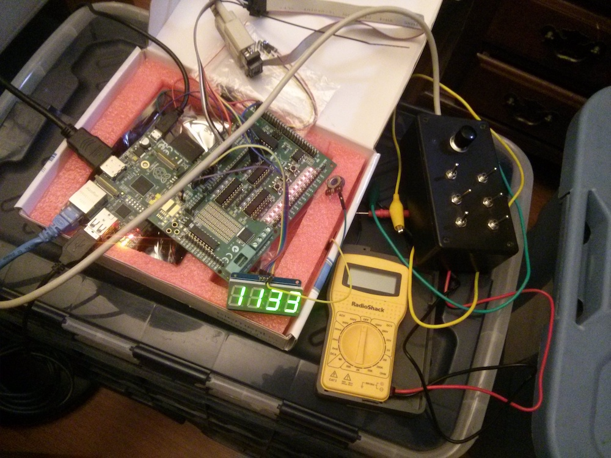
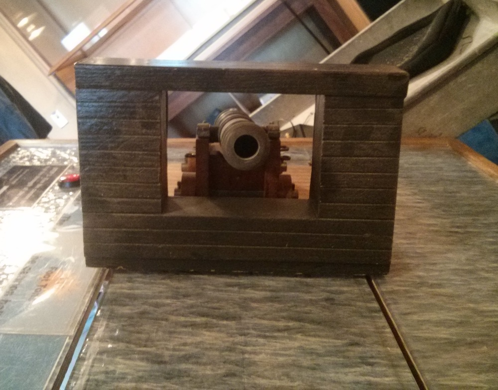
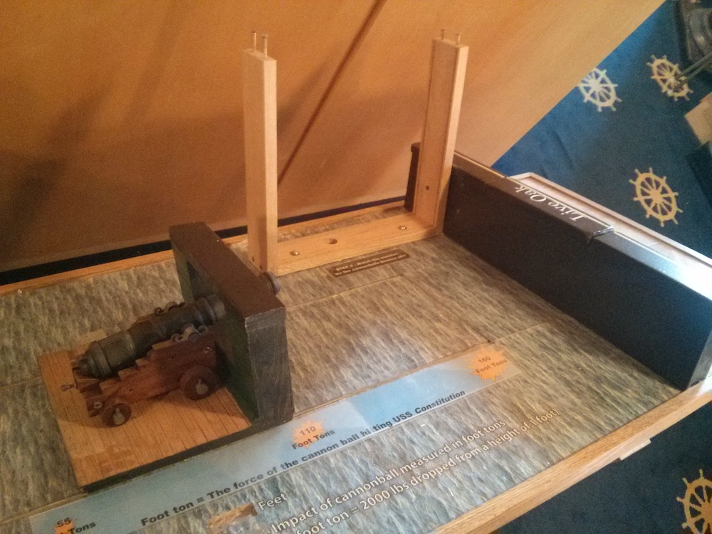

# Install

Use raspi-config to enable SPI, I2C, and Force audio to 3.5mm jack.

Load the correct I2C module by putting these lines in /etc/modules

    i2c-bcm2708 
    i2c-dev

Run these commands to set this code to launch as scratch would and then use raspi-config to set boot to scratch:

    sudo mv /usr/bin/scratch /usr/bin/scratch-old
    sudo ln -s /home/pi/USSConstitutionMuseum-CannonForce/USSCM-CannonForce-Java/run.sh /usr/bin/scratch

For debugging the led panels use the command "gpio i2cd" which can be installed using the following command:

    git clone git://git.drogon.net/wiringPi
    cd wiringPi
    ./build

# Hardware setup

##serial line

    1 gray top left
    2 white mid left
    3 black btm left
    4 brown main btn
    6   red   power
    7 orange led
    8 yellow btm right
    9   green  mid right switch
    10 blue top right

##LCD
    VCC : 5v
    GND : gnd
    SDA : GP0
    SCL : GP1

##Potentiometer 
    5v <-> AD1
    GP8 : CSnA
    GP9 : MISO
    GP10 : MOSI
    GP11 : SCLK

##Switches
    GP21 : 1 gray top left : Wood Type 1
    GP22 : 2 white mid left : Wood Type 2
    GP23 :  3 black btm left : Wood Type 3
    GP24 : 7 orange led
    GP25 : 4 brown main btn

# Dev

The application starts with run.sh. The Java class "Main" is started. The CannonForce class can be thought of as the interface with the hardware and the Main class takes care of all the application logic. Main sets a hardware listener on the main button and sets two scheduled threads to take care of waking the screen and polling the hardware for new values.

Main calls VideoPlayer to play videos and set images on the screen. Main calls SoundPlayer to play one specific audio file which is preloaded for speed.

Inside CannonForce the Pi4j library is used for access to the I/Os on the board. The SPI is used for the ADC on the GertBoard. I2C is used to connect to the LEDDisplays. The rest of the GPIOs used on the GertBoard are passed from the GertBoard to the RPi and used as standard GPIOs.

The getHardwareValues method does the logic of figuring out what kind of wood is inserted.

The DescriptiveStatistics class is used as a fixed size queue to keep track of the most recent samples taken from the ADC for the distance. It contains data for only the last second; a sample is taken every 50ms and the queue is length 20. This is very easy to adjust to make it feel beter for the user.

# Images

Here are some random images from the project:

